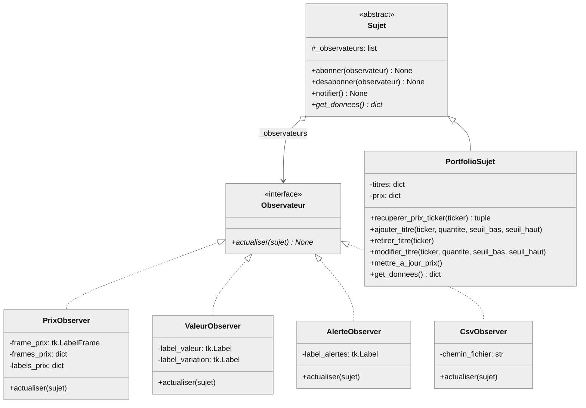

# Diagramme de classes — Patron Observateur

```mermaid
%%{init: {'theme': 'neutral'}}%%
classDiagram
    class Sujet {
        <<abstract>>
        #_observateurs: list
        +abonner(observateur) None
        +desabonner(observateur) None
        +notifier() None
        +get_donnees()* dict
    }

    class Observateur {
        <<interface>>
        +actualiser(sujet)* None
    }

    class PortfolioSujet {
        -titres: dict
        -prix: dict
        +recuperer_prix_ticker(ticker) tuple
        +ajouter_titre(ticker, quantite, seuil_bas, seuil_haut)
        +retirer_titre(ticker)
        +modifier_titre(ticker, quantite, seuil_bas, seuil_haut)
        +mettre_a_jour_prix()
        +get_donnees() dict
    }

    class PrixObserver {
        -frame_prix: tk.LabelFrame
        -frames_prix: dict
        -labels_prix: dict
        +actualiser(sujet)
    }

    class ValeurObserver {
        -label_valeur: tk.Label
        -label_variation: tk.Label
        +actualiser(sujet)
    }

    class AlerteObserver {
        -label_alertes: tk.Label
        +actualiser(sujet)
    }

    class CsvObserver {
        -chemin_fichier: str
        +actualiser(sujet)
    }

    Sujet <|-- PortfolioSujet
    Observateur <|.. PrixObserver
    Observateur <|.. ValeurObserver
    Observateur <|.. AlerteObserver
    Observateur <|.. CsvObserver
    Sujet o--> Observateur : _observateurs
```
